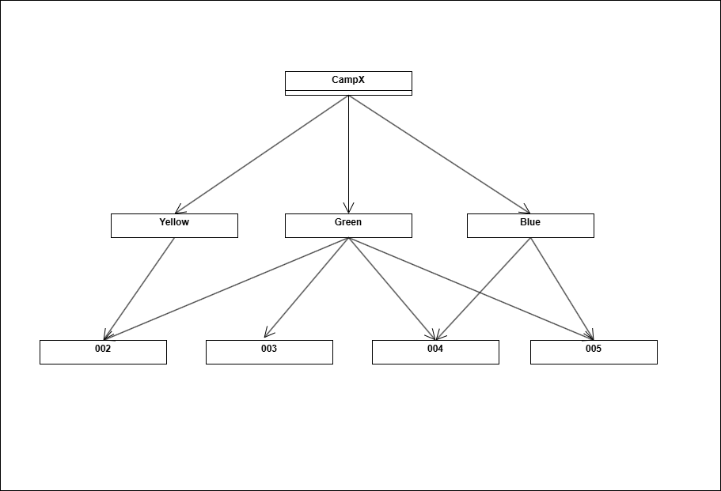
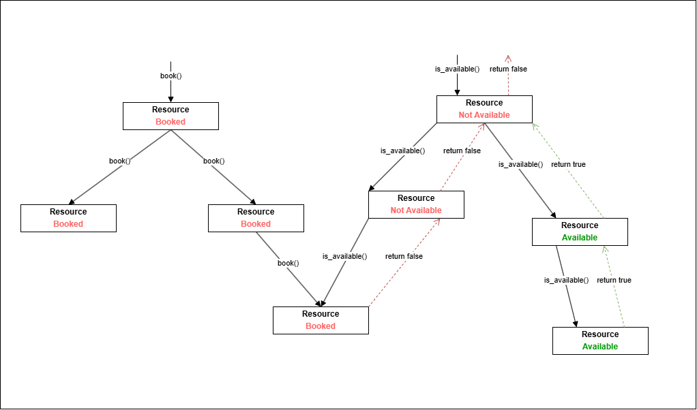

# Project Name

## Overview
A booker app for booking and check availability of resources

## Requirements
- C++17
- CMake 3.15 or higher

## Getting Started

### Clone the Repository
```bash
git clone https://github.com/JesperFritsch/booker_challange.git
```
or
```bash
git clone git@github.com:JesperFritsch/booker_challange.git
```
```bash
cd booker_challange
```

### Build Instructions

1. Create a build directory:
   ```bash
   mkdir build
   ```

2. Configure the project using CMake:
   ```bash
   cmake -S . -B build
   ```

3. Build the project:
   ```bash
   cmake --build build
   ```

### Running the Application
After building, the application executable will be located in the `build/bin/Debug` directory.
#### The application needs 3 arguments:
1. resourse.json (example file in /challange_files)
2. queries.txt (example file in /challange_files)
3. output.txt (will be created)

Run it with:
```bash
cd build/bin/Debug/
./booker resource.json queries.txt output.txt
```

## Testing
Run tests with:
```bash
   ctest --test-dir build --verbose -C Debug
```


## Basics of the algorithm

Resources can contain resources, this can be seen as a tree:



For a resource to be available all of the resources it contains (below it in the tree) must also be available.
When booking a resource, all resources below is also booked and therefore no longer available.

We can create a tree structure where each node in the tree is an object that represents a resource.
Each resource object can have a list of references to each of it's child objects in the tree.
This lets us find all resources that is contained by a certain other resource by looking at the
nodes children and then all of the childrens children and so on.

And when we book a resource we know that we should book all of its children and so on.

Since each resource object holds references to its children, two objects can hold a reference to the
same child object.

and if we look at the tree image we can see for example that both the nodes "Yellow" and "Green" references the node "002".
So when "Green" and all of its child objects are booked then "Yellow" is no longher available either since "002" is now booked.

